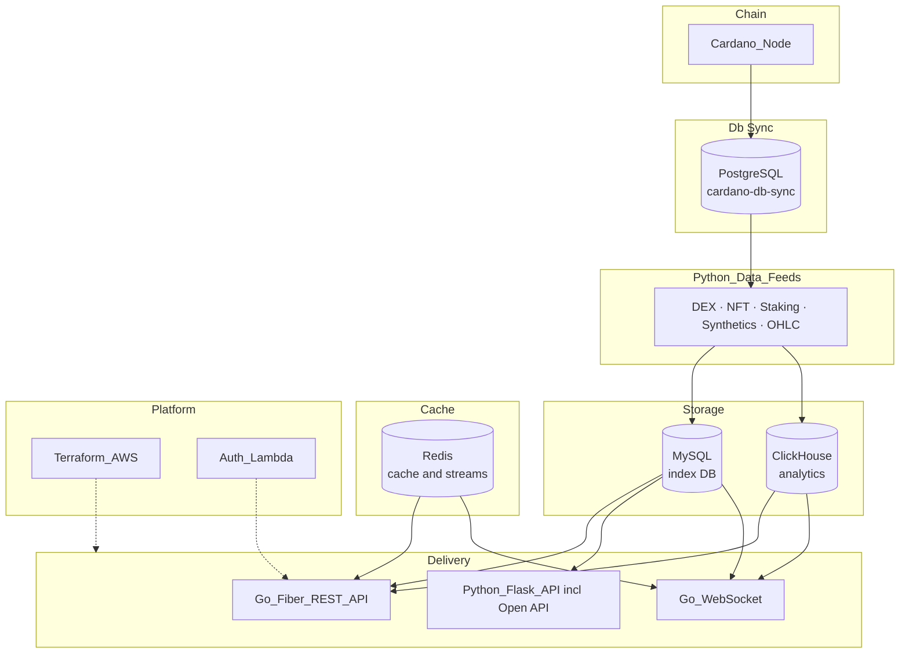
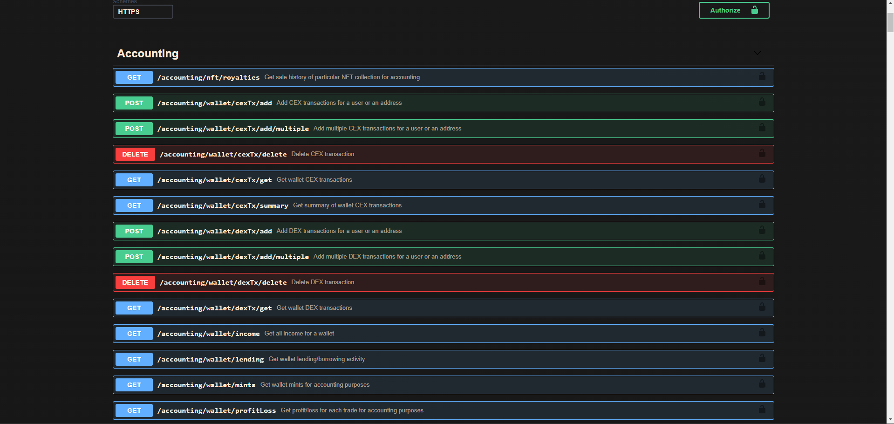
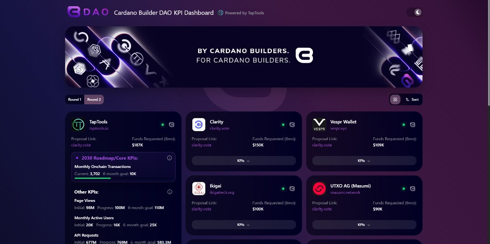

# TapTools Platform Showcase

Portfolio for backend and platform engineering work at **[TapTools.io](https://www.taptools.io/)** — a US-based Cardano analytics company. I joined as a backend engineer in October 2022, was promoted to **CTO** in March 2026, and worked **full time, remote from Egypt** until June 2026.

The live platform is winding down, but the engineering below remains documented here, in this repo, and in the [platform tour video](https://www.youtube.com/watch?v=jJPz-M-CfgU).

---

## Platform overview

TapTools indexes onchain market data for Cardano tokens and NFTs and powers portfolio analytics, charting, taxation (TapTax), a commercial Open API, and real-time market feeds for web and mobile clients.

| Product area | What it does |
|---|---|
| Market data | Token/NFT prices, volume, liquidity, OHLC charts |
| Portfolio | Positions, P&L, historic value, wallet activity |
| TapTax | Crypto taxation reports for Cardano investments |
| Open API | Rate-limited commercial data product for developers |
| Real-time | Live trades, candles, and token stats via WebSocket |
| CBDAO KPI | [Member KPI dashboard](https://cbdao.taptools.io/) (Cardano Builder DAO funded, Mar 2026) |

---

## Architecture (production)

**Production data path:** Cardano node syncs to **PostgreSQL** (cardano-db-sync). **Python data feeds** read chain state from Postgres, process millions of onchain records, and index into **MySQL** (application/index data) and **ClickHouse** (analytics). **Go Fiber REST API**, **Python Flask API**, and **Go WebSocket** serve web, mobile, and Open API clients from MySQL and ClickHouse, with Redis for caching and live streams.

**Platform layer:** Terraform-managed AWS (ECS Fargate, Lambda@Edge, RDS, ElastiCache, CloudFront/WAF, GitHub Actions OIDC). Auth microservice on Lambda@Edge (JWT, DPoP, Apple App Attest).

*Note: a Go ChainSync → Kinesis → ClickHouse pipeline was in development to eventually reduce db-sync dependency; production ran on the Postgres → feeds → MySQL/ClickHouse path above.*

---

## What I built and owned

- **Data platform** — cardano-db-sync (PostgreSQL) → Python feeds (DEX, NFT, staking, synthetics, OHLC) → MySQL index DB + ClickHouse analytics; millions of onchain records processed.
- **Go API & WebSocket** — High-performance Fiber REST API and real-time `go-ws` service for live trades, OHLC, and token statistics.
- **Data products** — OHLC builder, portfolio/taxation engines, commercial Open API, partner integrations with 15+ protocol teams.
- **Platform engineering** — Terraform modules/stacks, auth microservice (JWT, DPoP, Apple App Attest), multi-env AWS platform.
- **Leadership** — Promoted to CTO (Mar 2026); won [Cardano Builder DAO](https://cbdao.taptools.io/) funding; led Python→Go migration and ClickHouse modernization while staying hands-on.

---

## Tech stack

| Layer | Technologies |
|---|---|
| Languages | Go, Python, JavaScript |
| Backend | Go Fiber, Flask, REST, WebSocket, Celery, Asynq |
| Data | ClickHouse, MySQL, PostgreSQL, Redis |
| Chain | cardano-db-sync, Blockfrost *(ChainSync/Kinesis in development)* |
| Cloud | AWS (ECS, Lambda, RDS, S3, CloudFront, WAF), Terraform, GitHub Actions *(Kinesis in development)* |
| Observability | CloudWatch, Sentry, structured logging, Swagger |

---

## Platform tour

**[Watch the platform tour on YouTube](https://www.youtube.com/watch?v=jJPz-M-CfgU)**

---

## Product screenshots

Screenshots from when the platform was live:

### Homepage & data analytics

### Market overview

### Portfolio

### TapTax (crypto taxation)

### Open API

### API documentation (Swagger)

### CBDAO KPI Dashboard (Cardano Builder DAO, Mar 2026)
Funded deliverable — member KPI tracking for Cardano Builder DAO, powered by TapTools.

Live: [cbdao.taptools.io](https://cbdao.taptools.io/)

---

## Funding & recognition

- **[Cardano Builder DAO (CBDAO)](https://cbdao.taptools.io/)** — funding awarded March 2026; shipped KPI dashboard for DAO members.
- **[Cardano Catalyst](https://cardano.ideascale.com/c/cardano/landings)** — Fund 11 (2023), Fund 12 (2024).

---

## Source code

Application source is proprietary and owned by TapTools.io. This repository is a **public portfolio showcase** — architecture, screenshots, and links — not a code dump.

For technical inquiries, reach out via [LinkedIn](https://www.linkedin.com/in/yahiaabdelati/) or [GitHub](https://github.com/yahiaelpronc).

---

## Author

**Yahia Abdelatti** — Senior Backend Engineer · Blockchain & Data Platforms

- [LinkedIn](https://www.linkedin.com/in/yahiaabdelati/)
- [GitHub](https://github.com/yahiaelpronc)
- [TapTools showcase](https://github.com/yahiaelpronc/Taptools-Showcase) (this repo)
- [CV (LaTeX)](https://github.com/yahiaelpronc/cv)
